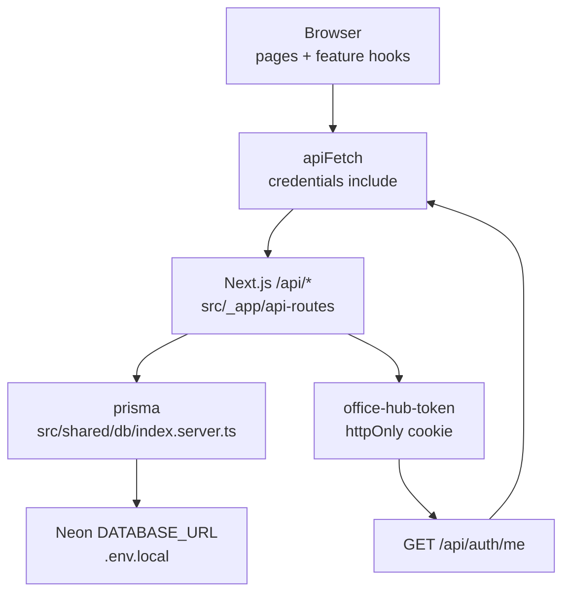

# Candidate 1: Subtractive single persistence

**Organizing structure:** **single typed persistence** (a unit type: API-only). Auth stays the existing httpOnly cookie session. The client session machine is React Query’s `useSession` — not a new ADT, not a mode flag.

Local `npm run dev` and `npm start` both talk to the same Next.js `/api/*` on this process, which already uses Prisma + the Neon `DATABASE_URL` in `.env.local`. Demo is deleted, not defaulted the other way. `isApiMode` and `NEXT_PUBLIC_USE_API` leave the codebase.

This candidate is deliberately **subtractive**. It does not add `SessionPhase`, `SessionGate`, a renamed fetch, a persistence port, or a boot-env aggregator. Those would re-encode “mode” as extra types after the second backend is gone.

---

## Usage (caller's view)

Usage is the spec. Types below are derived from these call sites.

### README quickstart (local)

```md
## Local development

`.env.local` already has Neon `DATABASE_URL`, `JWT_SECRET`, `SETUP_SECRET`,
`ADMIN_NAME`, and `ADMIN_PASSWORD`. Do not set a persistence flag. There isn't one.

1. `npm run db:migrate` if this Neon has not been baselined.
2. `npm run dev`
3. First empty database only:

   curl -X POST http://localhost:3000/api/setup \
     -H "x-setup-secret: $SETUP_SECRET"

4. Open http://localhost:3000 → sign in or register.
   HR is the seeded `ADMIN_NAME` account. Team is any registered user.
```

There is no “Continue in demo mode”, no Team/HR header switch, no `localStorage` key `office-hub-demo`.

`verify-office-hub` launches `npm run build && npm start` the same way. After this design, that production build is also API + Neon. Sign in is the baseline, not an optional flag.

### Call site 1 — feature hook (already the target shape)

```typescript
import { apiFetch } from "@/shared/api"
import { useQuery } from "@tanstack/react-query"

export function useSuggestions() {
    return useQuery({
        queryKey: ["suggestions"],
        queryFn: () => apiFetch<{ suggestions: Suggestion[] }>("/api/suggestions"),
    })
}
```

No `isApiMode` import. `apiFetch` always hits `/api/*` with `credentials: "include"`. The same file already looks like this except for the dead demo branch inside `apiFetch`.

### Call site 2 — auth consumer

```typescript
import { useAuth } from "@/features/auth"

export function AccountFooter() {
    const { user, isLoading, logout } = useAuth()
    if (isLoading || !user) return null
    return (
        <button type="button" onClick={() => void logout()}>
            Sign out {user.name}
        </button>
    )
}
```

`useAuth` returns `user`, `isLoading`, `login`, `register`, `logout`. It does not return `isApiMode` or `setAdminMode`. Admin vs team is `user.isAdmin` from Neon.

### Call site 3 — route protection

```typescript
import { useAuth } from "@/features/auth"

export function ProtectedLayout({ children }: { children: React.ReactNode }) {
    const { user, isLoading } = useAuth()
    const router = useRouter()
    const pathname = usePathname()

    useEffect(() => {
        if (isLoading || user) return
        router.replace(`/login?from=${encodeURIComponent(pathname)}`)
    }, [isLoading, user, router, pathname])

    if (isLoading) return <Loading />
    if (!user) return null
    return children
}
```

The `if (!isApiMode) return children` bypass is gone. Login is required in every environment, including local `next dev`.

### Call site 4 — login (no demo escape)

```typescript
const { user, login, register } = useAuth()
// Sign in / Register only. No Link to "/" as "Continue in demo mode".
```

---

## Shape



### Invariant (not a runtime export)

```typescript
// Design invariant only. Do not export. Do not switch on it.
// A one-variant union is encoded by deleting the other variant.
type Persistence = { readonly kind: "api" }
```

Callers never see `Persistence`. Putting `{ kind: "api" }` on the public surface would leak a decision that has no alternative (information leakage) and invite a second kind later.

### Session (existing types, no new ADT)

React Query already is the session machine: pending / success / error. Wrapping that as `unknown | guest | signed-in` is a pass-through of query status. Keep:

```typescript
// src/entities/user/model/types.ts — unchanged
type User = {
    id: number
    name: string
    isAdmin: boolean
}

// src/features/auth/ui/auth-provider.tsx
type AuthContextValue = {
    user: User | null
    isLoading: boolean
    login: (name: string, password: string) => Promise<void>
    register: (name: string, password: string) => Promise<void>
    logout: () => Promise<void>
}
```

Invariants encoded here:

- `user === null && !isLoading` means anonymous (show login). Includes 401 from `/api/auth/me`.
- `user !== null` means a Neon row, not a seeded in-browser persona.
- There is no `setAdminMode`. Role is not a client write.

`useSession` maps **401/403 → `null` user** (anonymous) and **rethrown 5xx** (outage, not “please log in”). That policy lives in the hook, not in a new session enum.

### Cookie security (the load-bearing local contract)

`verify-office-hub` and many local checks run `npm run build && npm start`. That sets `NODE_ENV=production` on `http://127.0.0.1:3000`. Today `setAuthCookie` uses `secure: process.env.NODE_ENV === "production"`, so the browser drops the cookie on HTTP and login looks successful then immediately 401s. Demo hid this. API-only local makes it a blocker.

```typescript
// src/shared/auth/index.server.ts
type CookieSecurity = { readonly secure: boolean }

function cookieSecurityFromRequest(request: NextRequest): CookieSecurity {
    return { secure: request.nextUrl.protocol === "https:" }
}
```

`Set-Cookie; Secure` only when the request itself is HTTPS (Vercel). Local HTTP `next dev` and `next start` both keep a working cookie. Do not key `secure` off `NODE_ENV`.

### What the system deliberately does not do

- Does not keep `demo-store.ts` for tests, offline, or “just in case.”
- Does not read `DATABASE_URL` in the client to decide a mode (server-only; cannot be a client signal).
- Does not auto-seed on boot (`/api/setup` is upsert against **shared** Neon).
- Does not add Next.js middleware as a second auth gate. `requireUser` on `/api/*` plus `ProtectedLayout` on pages is enough. Middleware would duplicate JWT policy on the edge.
- Does not introduce a persistence port with one implementation (pass-through).
- Does not rename `apiFetch`. The name already means “the app’s HTTP client.”

### Interface depth

Public surface after the change:

| Caller | Sees |
| --- | --- |
| Feature hooks | `apiFetch<T>(path, init)` and `ApiError` |
| Auth UI | `user`, `isLoading`, `login` / `register` / `logout` |
| Shell | `ProtectedLayout` always gates; sidebar is Sign out only |

Hidden behind that surface: cookie write/clear, JWT sign/verify, Prisma user lookup, Neon, JSON/`ApiError` mapping, 401 → anonymous in `useSession`.

The surface **shrinks** (`isApiMode`, `setAdminMode`, demo link, Team/HR switch all go). Complexity is not moved into new wrappers; it is deleted (demo) or already owned by `apiFetch` and `requireUser`.

---

## Function signatures

```typescript
// src/shared/api/client.ts
export class ApiError extends Error {
    status: number
    constructor(status: number, message: string)
}

export async function apiFetch<T>(
    path: string,
    options?: RequestInit,
): Promise<T>
// always fetch(path, { ...options, credentials: "include" })
// parse JSON; throw ApiError(status, data.error) when !ok
// no isApiMode branch

// src/features/auth/model/hooks.ts
export function useSession(): UseQueryResult<User | null>
// GET /api/auth/me
// ApiError 401 | 403 → return null (anonymous)
// other errors rethrow
// no `skip` argument

export function useLogin(): UseMutationResult<User, Error, { name: string; password: string }>
export function useRegister(): UseMutationResult<User, Error, { name: string; password: string }>
// both write queryClient.setQueryData(["auth", "session"], user)

// src/features/auth/ui/auth-provider.tsx
export function AuthProvider(props: { children: ReactNode }): JSX.Element
export function useAuth(): AuthContextValue
export function useRequiredUser(): User // throws if user is null
export function getAuthErrorMessage(error: unknown): string

// src/shared/auth/index.server.ts — existing, plus cookie change
export function cookieSecurityFromRequest(request: NextRequest): CookieSecurity
export function setAuthCookie(
    response: NextResponse,
    token: string,
    security: CookieSecurity,
): NextResponse
export function clearAuthCookie(
    response: NextResponse,
    security: CookieSecurity,
): NextResponse
export function requireUser(
    request: NextRequest,
): Promise<{ user: AuthUser } | { error: NextResponse }>
```

Bodies stay `throw new Error("not implemented")` only for the **new** cookie helper until fill-in. Existing route handlers (`login`, `me`, `register`, `logout`, bookings, …) keep their current signatures.

```typescript
export function cookieSecurityFromRequest(request: NextRequest): CookieSecurity {
    // TODO: use request.nextUrl.protocol === "https:"
    // Do not use NODE_ENV. `next start` locally is production + HTTP.
    throw new Error("not implemented")
}

export async function apiFetch<T>(path: string, options: RequestInit = {}): Promise<T> {
    const headers = new Headers(options.headers)
    if (!headers.has("Content-Type") && options.body) {
        headers.set("Content-Type", "application/json")
    }
    const response = await fetch(path, { ...options, headers, credentials: "include" })
    const data = (await response.json().catch(() => ({}))) as { error?: string } & T
    if (!response.ok) {
        throw new ApiError(response.status, data.error ?? "Request failed")
    }
    return data
}

export function useSession() {
    return useQuery({
        queryKey: ["auth", "session"] as const,
        queryFn: async (): Promise<User | null> => {
            try {
                const data = await apiFetch<{ user: User }>("/api/auth/me")
                return data.user
            } catch (error) {
                if (error instanceof ApiError && (error.status === 401 || error.status === 403)) {
                    return null
                }
                throw error
            }
        },
        retry: false,
    })
}
```

`AuthProvider` after deletion is the thin shell that already existed on the API path:

```typescript
export function AuthProvider({ children }: { children: ReactNode }) {
    const queryClient = useQueryClient()
    const session = useSession()
    const loginMutation = useLogin()
    const registerMutation = useRegister()

    const login = async (name: string, password: string) => {
        await loginMutation.mutateAsync({ name, password })
    }
    const register = async (name: string, password: string) => {
        await registerMutation.mutateAsync({ name, password })
    }
    const logout = async () => {
        await fetch("/api/auth/logout", { method: "POST", credentials: "include" })
        queryClient.removeQueries({ queryKey: ["auth", "session"] })
    }

    const value = {
        user: session.data ?? null,
        isLoading: session.isLoading,
        login,
        register,
        logout,
    }
    return <AuthContext.Provider value={value}>{children}</AuthContext.Provider>
}
```

Login/register mutations already `setQueryData` the session. Logout is idempotent: a second POST still clears the cookie (`maxAge: 0`); a second `removeQueries` is a no-op.

---

## Module map

| Module | Owns | Loses |
| --- | --- | --- |
| `src/shared/api/client.ts` | `apiFetch`, `ApiError` | demo short-circuit; `isApiMode` re-export |
| `src/shared/api/index.ts` | `apiFetch`, `ApiError` | `isApiMode` |
| `src/shared/config/app-config.ts` | theme + sidebar constants | `isApiMode` block |
| `src/shared/config/index.ts` | config barrel | `isApiMode` |
| `src/shared/auth/index.server.ts` | JWT, `requireUser`, cookie helpers | `secure: NODE_ENV === "production"` |
| `src/shared/db/index.server.ts` | Prisma + Neon | nothing (already the only store) |
| `src/_app/api-routes/**` | HTTP + Prisma | nothing |
| `src/features/auth/model/hooks.ts` | `useSession` without `skip`; 401 → null | `skip` flag |
| `src/features/auth/ui/auth-provider.tsx` | cookie session context | demo user state, `isApiMode`, `setAdminMode` |
| `src/widgets/app-shell/ui/protected-layout.tsx` | always gate | `!isApiMode` bypass |
| `src/widgets/app-shell/ui/SidebarAccountMenu.tsx` | Sign out | `isApiMode`, `onSetAdminMode`, Team/HR items |
| `src/widgets/app-shell/ui/app-shell-layout.tsx` | shell wiring | mode props into the menu |
| `src/_pages/login/ui/login-page.tsx` | credentials form | “Continue in demo mode” |
| `src/shared/lib/demo-store.ts` | — | **delete the file** |
| `.env.example`, `README.md` | required server env | `NEXT_PUBLIC_USE_API`, “demo is the default” |
| `.cursor/skills/verify-office-hub/**` | signed-in recipes | demo-mode launch, `demo-session.md` role toggle, localStorage isolation |

Unrelated dirty files (kitchen wishlist, suggestion hooks) stay out.

`.env.local` is not rewritten by this change (secrets). After merge, leftover `NEXT_PUBLIC_USE_API=false` and `VITE_USE_API=false` are ignored; they can be deleted by the human.

### Env contract (server)

| Var | Role |
| --- | --- |
| `DATABASE_URL` | PrismaNeon. Missing → throw at first DB use (already). |
| `JWT_SECRET` | Cookie JWT. Missing → throw at sign/verify (already). |
| `SETUP_SECRET` | `/api/setup` gate |
| `ADMIN_NAME`, `ADMIN_PASSWORD` | Seeded HR account |

No `NEXT_PUBLIC_*` persistence flag. PR #9’s `NEXT_PUBLIC_VERCEL_ENV === production | preview` OR is deleted with `isApiMode`; every deploy is already API.

Do **not** add `requireServerEnv()` that concatenates these checks. Each owner already fails closed. A boot aggregator is a pass-through that scatters the same invariant.

---

## Docs / verify rewrite (same change, not a second backend)

- `README.md`: local default is API + login. Drop the sentence “Demo mode is the default.” Drop `NEXT_PUBLIC_USE_API=true` from Vercel env list.
- `verify-office-hub` SKILL: baseline is production build **with login**. Doctor can keep `GET /api/auth/me` 401 unauthenticated and 200 with cookie. Never start a second instance against the same `DATABASE_URL`.
- Replace `features/demo-session.md` with a signed-in dashboard recipe: `/` → `/login` → sign in as a real account → `Dashboard`. Team vs HR is two accounts, not a toggle.
- Other feature files: drop “demo only” / header Team-HR preconditions; after mutations, restore via the UI (cancel the verify booking, revert inventory), not by wiping `office-hub-demo`.
- Do not write `localStorage` or call `demoApiFetch` from the console (the function will not exist).

---

## Red-flag screen

| Flag | Verdict |
| --- | --- |
| Shallow module | Pass. `apiFetch` keeps error + credentials policy; we do not add a one-impl port or a fetch rename. Auth surface shrinks. |
| Information leakage | Pass. `Persistence` is not exported. Cookie name and JWT stay server-only. Client `User` stays `entities/user`. Cookie `secure` is computed at the cookie boundary, not re-derived in the client. |
| Temporal decomposition | Pass. No LoadMode / ValidateMode / PersistMode pipeline. No `SessionPhase` that restates React Query’s pending/success/error. Cookie security is owned next to `setAuthCookie`, not in a boot step. |
| Pass-through method | Pass. No `getPersistence()`, no `SessionGate` that only forwards `useAuth()`, no `requireServerEnv()` that rethrows existing throws. `ProtectedLayout` keeps the redirect policy (that is not a forward). |

If implementation later wants middleware **and** `ProtectedLayout` **and** `requireUser` all checking the same JWT, that is the leakage/pass-through signal to scrap the extra gate.

---

## First fill-in order (not this candidate’s job)

1. Delete `demo-store.ts` and every `isApiMode` / `setAdminMode` / demo import.
2. Make `apiFetch` network-only; drop `useSession(skip)`.
3. Change `setAuthCookie` / `clearAuthCookie` to `cookieSecurityFromRequest`.
4. Rewrite verify/README so local and `npm start` assume login + Neon.
