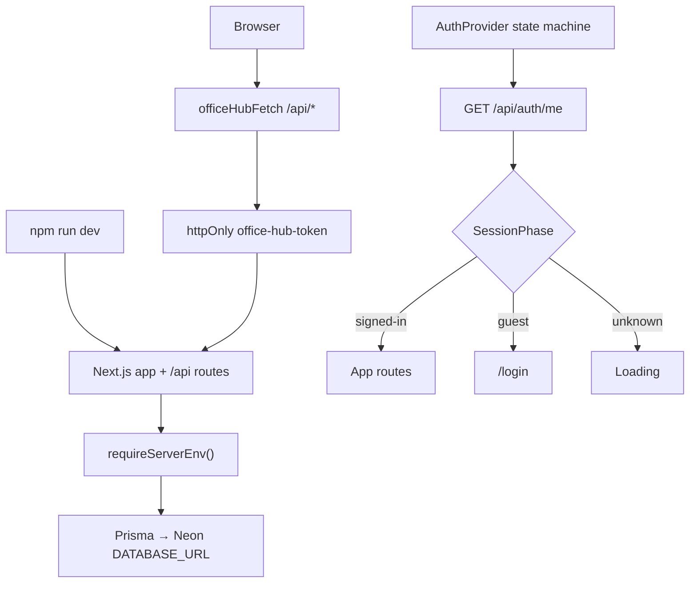

# Candidate 2: Session state machine + single HTTP transport

**Organizing structure:** authenticated **session state machine** (client) backed by one **HTTP transport module** (no persistence mode, no demo backend).

Local `npm run dev` is indistinguishable from preview/production at the application layer: every read/write goes to `/api/*` on the same Next.js process, which uses Prisma + Neon from server env. Demo mode and `isApiMode` are removed, not repurposed.

---

## Usage (caller's view)

### README quickstart (local dev)

```md
## Local development

1. Copy `.env.example` → `.env.local` and fill `DATABASE_URL`, `JWT_SECRET`, `SETUP_SECRET`, `ADMIN_PASSWORD`.
2. Seed the shared Neon sandbox once:

   curl -X POST http://localhost:3000/api/setup \
     -H "x-setup-secret: $SETUP_SECRET"

3. `npm run dev` → open http://localhost:3000/login, register or sign in as the seeded admin.
```

There is no demo toggle, no `NEXT_PUBLIC_USE_API`, and no offline/localStorage persistence.

### Call site 1 — data hook (unchanged ergonomics)

```typescript
import { useQuery } from "@tanstack/react-query"
import { officeHubFetch } from "@/shared/api"

export function useBookings() {
  return useQuery({
    queryKey: ["bookings"],
    queryFn: () => officeHubFetch<{ bookings: Booking[] }>("/api/bookings"),
  })
}
```

Callers never branch on mode. They always call `officeHubFetch`.

### Call site 2 — auth consumer

```typescript
import { useAuth } from "@/features/auth"

function Header() {
  const { user, logout } = useAuth()
  if (!user) return null
  return (
    <button type="button" onClick={() => void logout()}>
      Sign out {user.name}
    </button>
  )
}
```

`useAuth` exposes `user | null`, `isLoading`, and auth actions. It does **not** expose `isApiMode`, `setAdminMode`, or demo helpers.

### Call site 3 — route protection

```typescript
import { SessionGate } from "@/features/auth"

export function ProtectedLayout({ children }: { children: React.ReactNode }) {
  return <SessionGate>{children}</SessionGate>
}
```

`SessionGate` reads session phase from context: spinner while `unknown`, redirect to login when `guest`, render children when `signed-in`.

---

## Shape

### Core types

```typescript
// src/features/auth/model/session.ts

import type { User } from "@/entities/user"

/** Client-side auth lifecycle. Exactly one phase at a time. */
export type SessionPhase =
  | { status: "unknown" }
  | { status: "guest" }
  | { status: "signed-in"; user: User }

export type SessionSnapshot = SessionPhase & {
  /** True only while status === "unknown" and bootstrap has not settled. */
  isLoading: boolean
}

/** Pure transitions — no I/O. AuthProvider applies these to React state. */
export function sessionFromMeResult(
  current: SessionPhase,
  result: { user: User } | null
): SessionPhase {
  if (result?.user) return { status: "signed-in", user: result.user }
  return { status: "guest" }
}

export function sessionAfterLogin(user: User): SessionPhase {
  return { status: "signed-in", user }
}

export function sessionAfterLogout(): SessionPhase {
  return { status: "guest" }
}

export function sessionUser(phase: SessionPhase): User | null {
  return phase.status === "signed-in" ? phase.user : null
}
```

```typescript
// src/shared/api/client.ts

export class ApiError extends Error {
  constructor(
    readonly status: number,
    message: string
  ) {
    super(message)
  }
}

/** Sole client transport. Always same-origin /api with cookie credentials. */
export async function officeHubFetch<T>(
  path: `/api/${string}`,
  options: RequestInit = {}
): Promise<T> {
  const headers = new Headers(options.headers)
  if (!headers.has("Content-Type") && options.body) {
    headers.set("Content-Type", "application/json")
  }

  const response = await fetch(path, {
    ...options,
    headers,
    credentials: "include",
  })

  const data = (await response.json().catch(() => ({}))) as { error?: string } & T

  if (!response.ok) {
    throw new ApiError(response.status, data.error ?? "Request failed")
  }

  return data
}

/** Back-compat alias during migration; delete once call sites renamed. */
export const apiFetch = officeHubFetch
```

```typescript
// src/shared/runtime/server-env.ts  (import "server-only")

export type ServerEnv = {
  databaseUrl: string
  jwtSecret: string
  setupSecret: string
  adminName: string
  adminPassword: string
}

let cached: ServerEnv | null = null

/** Fail fast on first server request if Neon/auth env is missing. */
export function requireServerEnv(): ServerEnv {
  if (cached) return cached

  const databaseUrl = process.env.DATABASE_URL
  const jwtSecret = process.env.JWT_SECRET
  const setupSecret = process.env.SETUP_SECRET
  const adminPassword = process.env.ADMIN_PASSWORD

  const missing: string[] = []
  if (!databaseUrl) missing.push("DATABASE_URL")
  if (!jwtSecret) missing.push("JWT_SECRET")
  if (!setupSecret) missing.push("SETUP_SECRET")
  if (!adminPassword) missing.push("ADMIN_PASSWORD")

  if (missing.length > 0) {
    throw new Error(
      `Office Hub server env incomplete: ${missing.join(", ")}. ` +
        `Copy .env.example to .env.local and restart dev server.`
    )
  }

  cached = {
    databaseUrl,
    jwtSecret,
    setupSecret,
    adminName: process.env.ADMIN_NAME ?? "HR Admin",
    adminPassword,
  }
  return cached
}
```

Server route handlers call `requireServerEnv()` at the top (or via a thin `withServerEnv` wrapper) so misconfigured local dev surfaces a clear 500 instead of opaque Prisma errors.

### Auth provider (state machine owner)

```typescript
// src/features/auth/ui/auth-provider.tsx

type AuthContextValue = {
  user: User | null
  isLoading: boolean
  login: (name: string, password: string) => Promise<void>
  register: (name: string, password: string) => Promise<void>
  logout: () => Promise<void>
}

export function AuthProvider({ children }: { children: ReactNode }) {
  const queryClient = useQueryClient()
  const [phase, setPhase] = useState<SessionPhase>({ status: "unknown" })

  const sessionQuery = useQuery({
    queryKey: ["auth", "session"],
    queryFn: () => officeHubFetch<{ user: User }>("/api/auth/me"),
    retry: false,
  })

  useEffect(() => {
    if (sessionQuery.isPending) return
    if (sessionQuery.isError) {
      setPhase({ status: "guest" })
      return
    }
    setPhase(sessionFromMeResult(phase, sessionQuery.data ?? null))
  }, [sessionQuery.isPending, sessionQuery.isError, sessionQuery.data])

  const login = useCallback(async (name: string, password: string) => {
    const data = await officeHubFetch<{ user: User }>("/api/auth/login", {
      method: "POST",
      body: JSON.stringify({ name, password }),
    })
    queryClient.setQueryData(["auth", "session"], data)
    setPhase(sessionAfterLogin(data.user))
  }, [queryClient])

  const register = useCallback(async (name: string, password: string) => {
    const data = await officeHubFetch<{ user: User }>("/api/auth/register", {
      method: "POST",
      body: JSON.stringify({ name, password }),
    })
    queryClient.setQueryData(["auth", "session"], data)
    setPhase(sessionAfterLogin(data.user))
  }, [queryClient])

  const logout = useCallback(async () => {
    await officeHubFetch("/api/auth/logout", { method: "POST" })
    queryClient.removeQueries({ queryKey: ["auth", "session"] })
    setPhase(sessionAfterLogout())
  }, [queryClient])

  const value = useMemo(
    () => ({
      user: sessionUser(phase),
      isLoading: phase.status === "unknown",
      login,
      register,
      logout,
    }),
    [phase, login, register, logout]
  )

  return <AuthContext.Provider value={value}>{children}</AuthContext.Provider>
}
```

### Session gate (replaces mode branching in ProtectedLayout)

```typescript
// src/features/auth/ui/session-gate.tsx

export function SessionGate({ children }: { children: React.ReactNode }) {
  const { user, isLoading } = useAuth()
  const router = useRouter()
  const pathname = usePathname()

  useEffect(() => {
    if (isLoading || user) return
    router.replace(`/login?from=${encodeURIComponent(pathname)}`)
  }, [isLoading, user, router, pathname])

  if (isLoading) {
    return (
      <div className="flex min-h-screen items-center justify-center bg-background text-sm text-muted-foreground">
        Loading...
      </div>
    )
  }

  if (!user) return null

  return children
}
```

### Function signatures (server — unchanged contract, stricter boot)

Existing handlers in `src/_app/api-routes/**` keep their HTTP contracts. Add env guard at boundary:

```typescript
// src/shared/auth/index.server.ts (add at top of requireUser)

export async function requireUser(request: NextRequest) {
  requireServerEnv() // not implemented: ensures JWT_SECRET + DB before token work
  // ... existing token + prisma lookup
}
```

Auth cookie behavior stays: httpOnly `office-hub-token`, `credentials: "include"` on client.

---

## Module map

| Module | Owns | Deletes / stops exporting |
|--------|------|---------------------------|
| `src/shared/api/client.ts` | `officeHubFetch`, `ApiError` | `isApiMode` re-export; demo branch |
| `src/shared/api/index.ts` | public API surface | `isApiMode` |
| `src/shared/runtime/server-env.ts` | `requireServerEnv`, cached parse | — (new) |
| `src/shared/config/app-config.ts` | theme, sidebar constants | `isApiMode` |
| `src/features/auth/model/session.ts` | `SessionPhase`, pure transitions | — (new) |
| `src/features/auth/model/hooks.ts` | optional thin wrappers | `skip` param on `useSession` |
| `src/features/auth/ui/auth-provider.tsx` | session state machine + mutations | demo imports, `isApiMode`, `setAdminMode` |
| `src/features/auth/ui/session-gate.tsx` | route protection by session phase | — (new; or inline in protected-layout) |
| `src/widgets/app-shell/ui/protected-layout.tsx` | layout shell | `isApiMode` branches → delegate to `SessionGate` |
| `src/widgets/app-shell/ui/SidebarAccountMenu.tsx` | sign-out menu | demo role switch, `isApiMode` prop |
| `src/_pages/login/ui/login-page.tsx` | login/register form | "Continue in demo mode" link, `isApiMode` |
| `src/shared/lib/demo-store.ts` | — | **delete entire file** |
| `.env.example`, `README.md` | local setup docs | `NEXT_PUBLIC_USE_API`, `VITE_USE_API` |
| `.cursor/skills/verify-office-hub/**` | verification flow | demo assumptions; document setup + login |

### Data flow



### Invariants encoded in types

- `SessionPhase` is a discriminated union — impossible to be "signed in" without a `User`.
- `officeHubFetch` path template `` `/api/${string}` `` — callers cannot accidentally hit demo or external URLs through the shared client.
- No `PersistenceKind` or `isApiMode` in public exports — compile errors if a branch reappears.

### Validation boundaries

| Boundary | Validates |
|----------|-----------|
| `requireServerEnv()` | server env completeness (once, cached) |
| Route handlers (existing Zod) | request bodies |
| `requireUser()` | JWT + live user row in Neon |
| `officeHubFetch` | HTTP status → `ApiError` |
| `sessionFromMeResult` | maps wire `{ user }` → phase (401 → guest) |

### Deliberately not done

- No in-browser persistence backend or localStorage domain state.
- No `NEXT_PUBLIC_*` flag to re-enable demo without code change.
- No MSW/fixture layer in this change (tests can mock `officeHubFetch` at module boundary if needed later).
- No automatic `/api/setup` on dev boot (explicit curl keeps seeding auditable).

---

## Migration pseudocode

```typescript
// 1. Delete demo-store.ts and every import.

// 2. Replace isApiMode branches — example protected-layout.tsx
export function ProtectedLayout({ children }: { children: React.ReactNode }) {
  return <SessionGate>{children}</SessionGate>
}

// 3. SidebarAccountMenu — drop demo role switch entirely.
type SidebarAccountMenuProps = {
  onSignOut: () => void | Promise<void>
}

// 4. app-config.ts — remove isApiMode block entirely.

// 5. Global rename (optional pass): apiFetch → officeHubFetch

// 6. .env.local — user removes NEXT_PUBLIC_USE_API=false (ignored after delete)

// 7. verify-office-hub skill — add setup curl + login step before UI checks
```

---

## Red-flag self-screen

| Flag | Assessment |
|------|------------|
| Shallow module | `officeHubFetch` is thin by design; depth lives in `AuthProvider` + `session.ts` transitions and server `requireServerEnv`. Acceptable. |
| Information leakage | Removing `isApiMode` from config, api, and auth context prevents mode leaking across layers. Wire `{ user }` parsed once into `SessionPhase`. |
| Temporal decomposition | No separate load/validate/save modules; bootstrap is one `useQuery` + `sessionFromMeResult`. |
| Pass-through | `SessionGate` adds policy (redirect, spinner); not a naked forwarder. |
