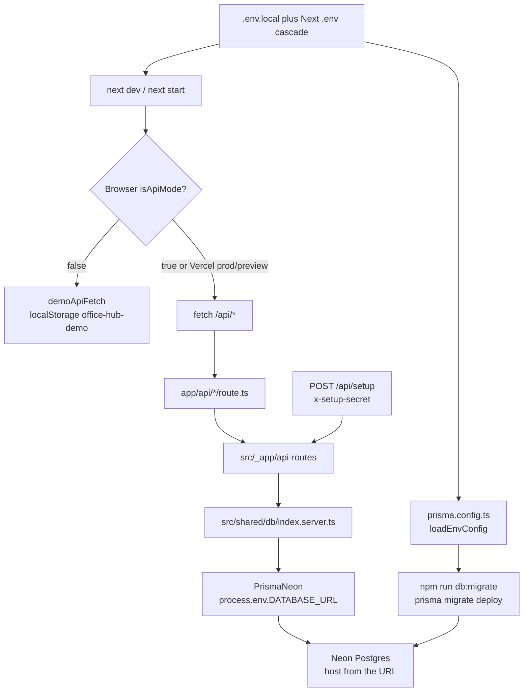

# How Office Hub connects to Postgres / Neon

## Overview

Office Hub has one database wire: `process.env.DATABASE_URL` into Prisma 7’s Neon adapter. Next.js loads `.env.local` for `npm run dev`; Prisma CLI loads the same Next env files via `prisma.config.ts`. There is no Prisma `seed` script — bootstrap is `POST /api/setup`. Application code never names a Neon project, never reads Vercel `POSTGRES_*` aliases, and never branches the URL by environment. Isolation is therefore an env-and-ops problem, not a code fork. This checkout’s `.env.local` already points at a `*.neon.tech` / `neondb` host (not localhost) and also carries unused Marketplace `POSTGRES_*` / `PG*` aliases plus `VERCEL_OIDC_TOKEN`.

## Key Concepts

- **`DATABASE_URL`** is the only connection string the app and Prisma CLI consume. Missing it throws at Prisma client construction (`src/shared/db/index.server.ts`) or leaves `prisma.config.ts` with an undefined datasource URL.
- **`PrismaNeon` (`@prisma/adapter-neon`)** wraps `@neondatabase/serverless` (`Pool` / WebSocket path). Schema provider is `postgresql`. There is no `@prisma/adapter-pg` in `package.json`.
- **Env loaders are Next’s, not a custom dotenv layer.** `next dev` / `next start` use Next’s standard `.env*` cascade. `prisma.config.ts` calls `loadEnvConfig(process.cwd())` from `@next/env` so `npm run db:migrate` sees the same files.
- **Seed is an HTTP upsert**, not `prisma db seed`. `POST /api/setup` gated by `x-setup-secret` === `SETUP_SECRET`.
- **`isApiMode` does not choose a database.** It only chooses whether the browser calls `/api/*` or `localStorage` demo. Route handlers always use the Prisma singleton if they run.
- **Shared Neon is operational, not encoded.** No host, project id, or “production vs local” branch exists in source. Sharing happens when local `.env.local` and Vercel hold the same URL.

## How It Works



**Runtime (Next process).** `src/shared/db/index.server.ts` is `server-only`. On first import it reads `DATABASE_URL`, constructs `new PrismaNeon({ connectionString })`, then `new PrismaClient({ adapter })`. In non-production it caches the client on `globalThis` to survive HMR. Every API slice that touches Postgres imports this singleton (`auth`, `bookings`, `inventory`, `suggestions`, `lunch`, `restaurants`, `setup`).

**CLI.** `package.json` `db:migrate` is `prisma migrate deploy`. Prisma 7 keeps the URL out of `prisma/schema.prisma` (`datasource db { provider = "postgresql" }` only) and reads it from `prisma.config.ts`. `db:generate` / `postinstall` run `prisma generate` into gitignored `generated/prisma`.

**Seed.** After migrate, README’s local path is:

```bash
curl -X POST http://localhost:3000/api/setup \
  -H "x-setup-secret: <SETUP_SECRET>"
```

The handler upserts coffee/milk inventory, the `ADMIN_NAME` / `ADMIN_PASSWORD` HR user, and `LUNCH_RESTAURANT_SEEDS`. It does not change schema. There is no `prisma.seed` key and no `db/seed.sql` (that path is listed as removed in `scripts/verify-migration.mjs`).

**What the browser must do to reach Neon.** `isApiMode` is true when `NEXT_PUBLIC_USE_API === "true"` **or** `NEXT_PUBLIC_VERCEL_ENV` is `production` or `preview`. This `.env.local` currently has `NEXT_PUBLIC_USE_API=true` (and leftover `VITE_USE_API=true`, unread by Next). Vercel prod/preview force API mode even if the public flag is off.

**Pointing local `npm run dev` at a non-production database.** No application source change is required if the target is still Neon (another project or branch):

1. Change **only** `DATABASE_URL` in `.env.local` to the non-prod connection string. Restart `next dev` so the process and the Prisma singleton pick it up.
2. Run `npm run db:migrate` against that same URL (CLI uses the same file). On a brand-new empty DB, deploy all migrations. On a copy of an already-baselined Neon, you may still need `npx prisma migrate resolve --applied 0_init` first — `0_init` is `CREATE TABLE IF NOT EXISTS` written for the existing production schema.
3. With the new URL live in the Next process, hit `POST /api/setup` once. That upserts into whatever `DATABASE_URL` the running server has.
4. Keep `NEXT_PUBLIC_USE_API=true` if you want the UI to use `/api/*` (otherwise you get demo `localStorage` and never touch the new DB from the browser).

If the target is **local Postgres** (not Neon), env change is not enough: the runtime adapter is Neon’s serverless driver. You would add `@prisma/adapter-pg` (or equivalent TCP adapter) and switch `createPrismaClient()` off `PrismaNeon`. `prisma.config.ts` and `schema.prisma` can stay `postgresql`. That adapter is not in the repo today.

Vercel Marketplace env stays independent. Local isolation does not change production unless you also change the Vercel `DATABASE_URL`. Conversely, `vercel env pull` will rewrite `.env.local` back to the pulled (typically production) aliases.

## Where Things Live

| Concern | Path |
| --- | --- |
| Prisma client + Neon adapter | `src/shared/db/index.server.ts` |
| Prisma schema (no URL) | `prisma/schema.prisma` |
| CLI datasource URL | `prisma.config.ts` |
| Env template | `.env.example` (`DATABASE_URL`, JWT/setup/admin, `NEXT_PUBLIC_USE_API=false`) |
| Local secrets (gitignored) | `.env.local` — Neon `DATABASE_URL` / `DATABASE_URL_UNPOOLED`, Vercel `POSTGRES_*` + `PG*`, `VERCEL_OIDC_TOKEN` |
| Env ignore | `.gitignore` ignores `.env*` except `.env.example` |
| Seed handler | `src/_app/api-routes/setup/index.ts` re-exported by `app/api/setup/route.ts` |
| Lunch seed rows | `src/shared/config/lunch-restaurants.ts` (`LUNCH_RESTAURANT_SEEDS`) |
| Migrate script | `package.json` → `db:migrate` = `prisma migrate deploy` |
| Generated client | `generated/prisma` (gitignored) |
| Migrations | `prisma/migrations/0_init`, `1_link_titles_and_lunch_vote`, `2_empty_unlinked_restaurant_pool`, `2_lunch_multi_pick_and_requests` |
| Local + Vercel docs | `README.md` |
| Architecture note | `docs/next-prisma-fsd.md` |
| “Shared Neon, do not parallelize” | `.cursor/skills/verify-office-hub/SKILL.md` |
| Client bypass of `/api/*` | `src/shared/config/app-config.ts`, `src/shared/api/client.ts` |

Route handlers that import Prisma: `src/_app/api-routes/{auth/login,auth/register,bookings,inventory,suggestions,lunch,restaurants,setup}` and `src/shared/auth/index.server.ts`. `GET /api/auth/me` uses `requireUser` (JWT + Prisma user lookup), not a second pool.

## Gotchas

- **`.env.local` is already a remote Neon, not localhost.** Host suffix is `neon.tech`, database name `neondb`. Nine values mention `neon.tech`; none mention localhost. `POSTGRES_URL`, `POSTGRES_PRISMA_URL`, `POSTGRES_URL_NON_POOLING`, `POSTGRES_URL_NO_SSL`, `DATABASE_URL_UNPOOLED`, and `PGHOST*` are present and unused by application TypeScript. They will not retarget the app if you only change `DATABASE_URL`, but they will confuse the next `vercel env pull` or a human who copies the wrong key.
- **`VERCEL_OIDC_TOKEN` is unused.** Nothing in `src/` or Prisma config reads it. It does not authenticate Prisma.
- **No code assumes a named production Neon.** The shared-DB risk is “same string in two places.” `verify-office-hub` already treats API mode as a shared sandbox and forbids a second instance on the same `DATABASE_URL`.
- **Demo mode is not DB isolation for CLI or curl.** `NEXT_PUBLIC_USE_API=false` keeps the UI off Neon; `npm run db:migrate` and `POST /api/setup` still hit `DATABASE_URL`. Calling `/api/*` directly also constructs Prisma.
- **`/api/setup` is upsert, not a private local seed.** On a URL that is still production it resets the admin password and re-upserts the lunch pool. Do not run it against prod to “test seed.”
- **README vs setup disagree on lunch.** README says the restaurant pool starts empty after setup. The handler upserts `LUNCH_RESTAURANT_SEEDS` (Japadog, Mezze, …).
- **Two migrations share the `2_` prefix.** `2_empty_unlinked_restaurant_pool` and `2_lunch_multi_pick_and_requests` both exist. Fresh `migrate deploy` applies both in directory-name order; this is easy to misread as one “migration 2.”
- **`0_init` is a baseline for the existing Neon.** Re-running it on a DB that already has tables is meant to be idempotent (`IF NOT EXISTS`). Prisma’s migration history still needs `migrate resolve --applied 0_init` on that existing database before later migrations apply.
- **PrismaNeon ≠ arbitrary local Postgres.** A `postgresql://…@localhost` URL without an adapter swap is not a supported path in this repo. Stay on Neon (separate branch/project) if you want an env-only cutover.
- **Singleton + env.** Changing `.env.local` without restarting `next dev` leaves the cached `globalThis.prisma` on the old URL.
- **`.env.example` is not a second database profile.** It is a placeholder URL. Isolation is not “use `.env` vs `.env.local`”; it is “put a different `DATABASE_URL` in `.env.local` and do not overwrite it from Vercel prod.”
