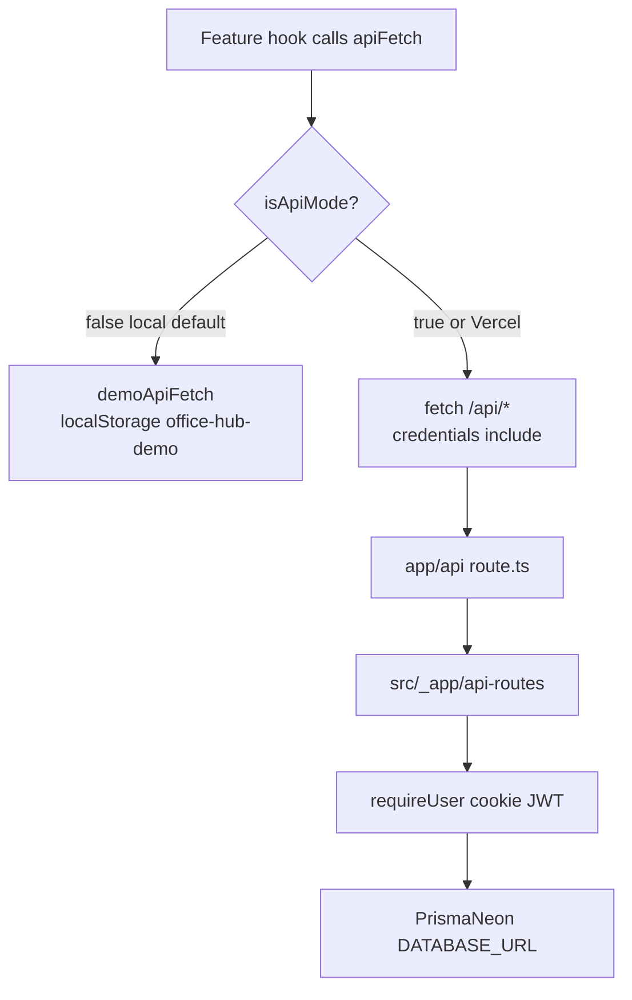

# How Office Hub chooses demo vs API

## Overview

The browser never talks to Prisma. `apiFetch` either hits `/api/*` (cookie session, Neon) or a localStorage fake (`office-hub-demo`). The switch is a compile-time boolean, `isApiMode`. Local `npm run dev` is demo unless `NEXT_PUBLIC_USE_API=true`. Vercel production and preview already force API mode. This machine already has Neon in `.env.local`, but the flag is `false`, so the UI never reaches it.

## Key Concepts

- `isApiMode` (`src/shared/config/app-config.ts`). True when `NEXT_PUBLIC_USE_API === "true"` or `NEXT_PUBLIC_VERCEL_ENV` is `production` or `preview`.
- `apiFetch` (`src/shared/api/client.ts`). The only client HTTP helper. Demo short-circuits here.
- `demoApiFetch` / `DemoState` (`src/shared/lib/demo-store.ts`). In-browser clone of the route handlers.
- `AuthProvider`. API mode reads `/api/auth/me`. Demo mode seeds `DEFAULT_DEMO_USER` and never logs in.
- `office-hub-token`. httpOnly JWT cookie used only in API mode.

## How It Works

Auth follows the same split. `ProtectedLayout` returns children immediately when `!isApiMode`. Login's "Continue in demo mode" and the sidebar Team/HR switch exist only for that path.

## Where Things Live

- Switch: `src/shared/config/app-config.ts`
- Client: `src/shared/api/client.ts`
- Demo backend: `src/shared/lib/demo-store.ts`
- Auth UI: `src/features/auth/ui/auth-provider.tsx`, `src/_pages/login/ui/login-page.tsx`
- Gate: `src/widgets/app-shell/ui/protected-layout.tsx`
- Demo role UI: `src/widgets/app-shell/ui/SidebarAccountMenu.tsx`
- Real DB: `src/shared/db/index.server.ts`
- Real auth: `src/shared/auth/index.server.ts`
- Verify default: `.cursor/skills/verify-office-hub/SKILL.md`

## Gotchas

- `NEXT_PUBLIC_*` is inlined at build time. Changing `.env.local` requires a restart of `next dev`. A production `npm start` needs a rebuild.
- `.env.local` still has leftover `VITE_USE_API`. Nothing reads it.
- PR #9 made Vercel API-only. Local default stayed demo on purpose.
- `verify-office-hub` launches `npm run build && npm start` without the flag, so it proves demo, not Neon.
- Demo and API share URL shapes. Feature hooks do not know which backend they hit.
